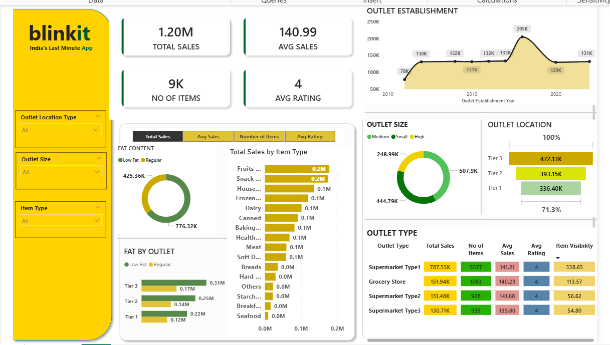

# Blinkit Sales Dashboard

## Project Overview
This project analyzes Blinkit retail sales data to understand product performance, outlet performance, and sales trends.

## Tools Used
- Power BI
- Excel

## Key Analysis
- Total sales and average sales
- Sales by outlet size
- Sales by item type
- Outlet location performance

## Dashboard Preview

